# Wheat-Disease-Detection-System
基于pyqt5、mysql、yolov7、chatgpt的小麦病害检测系统设计与实现
## 效果展示

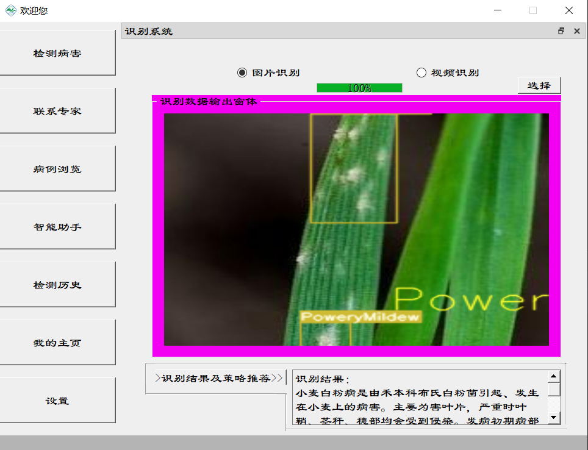
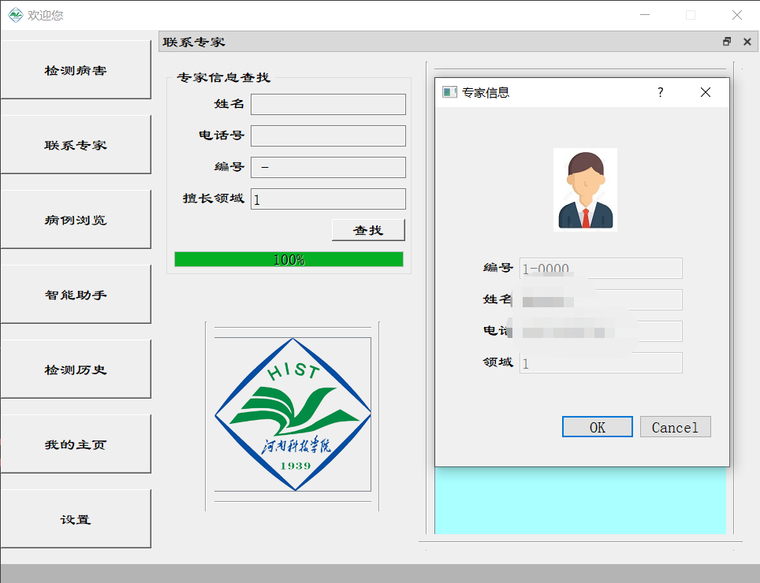
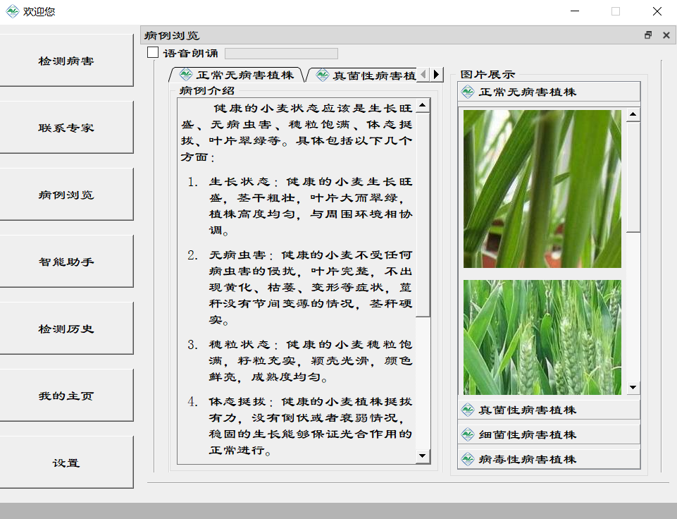
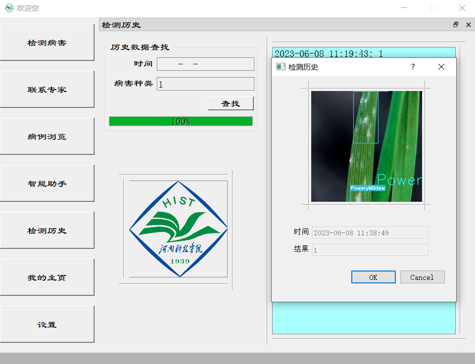
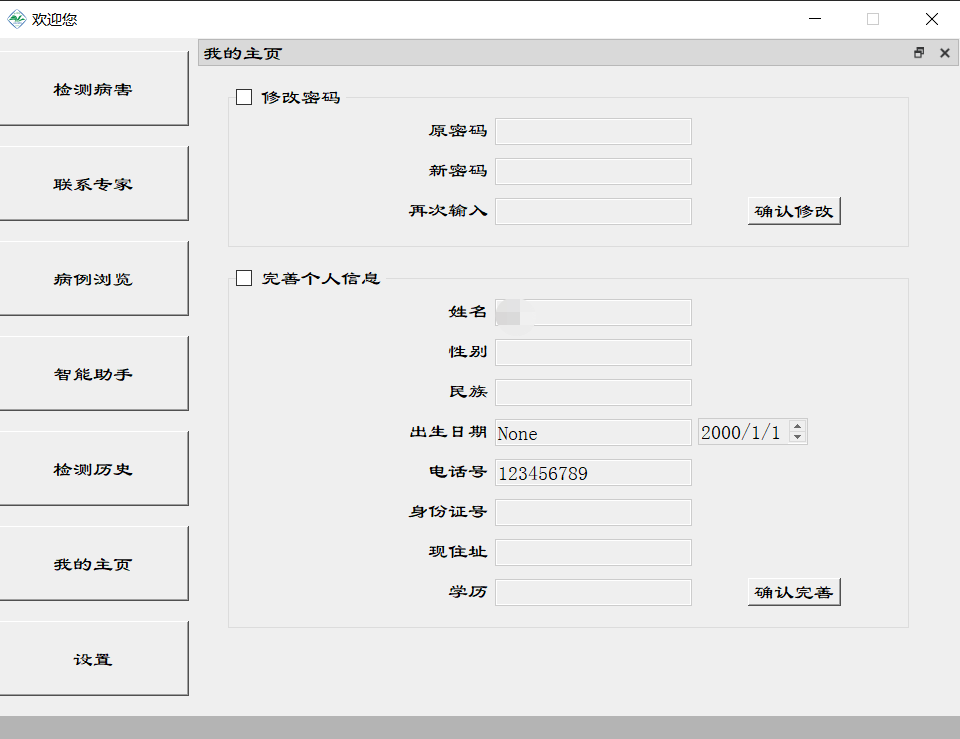
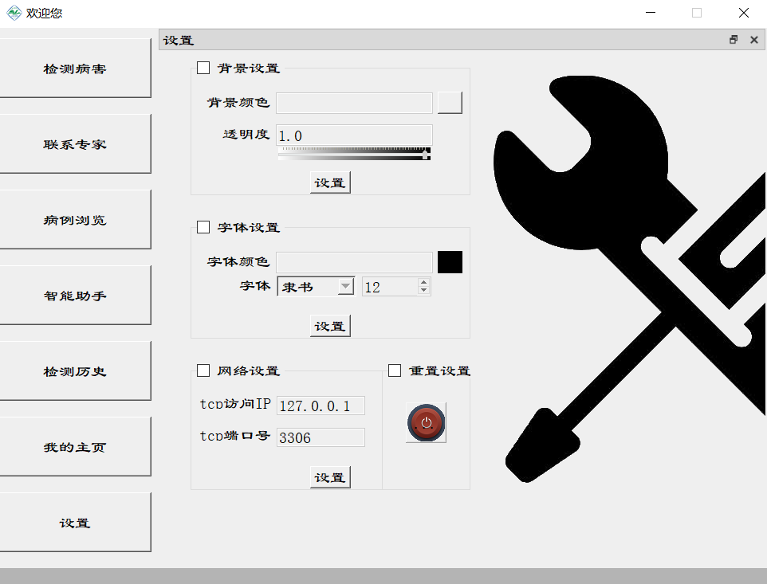
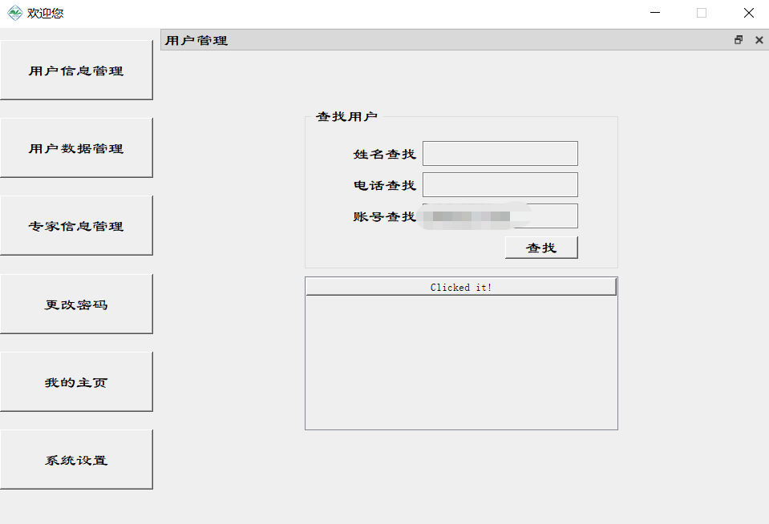

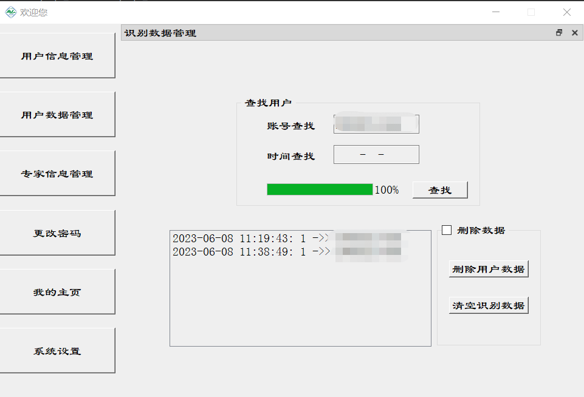
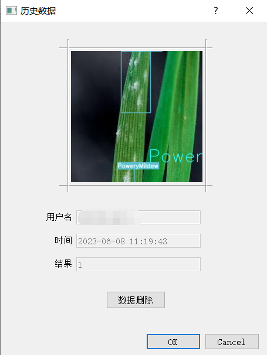
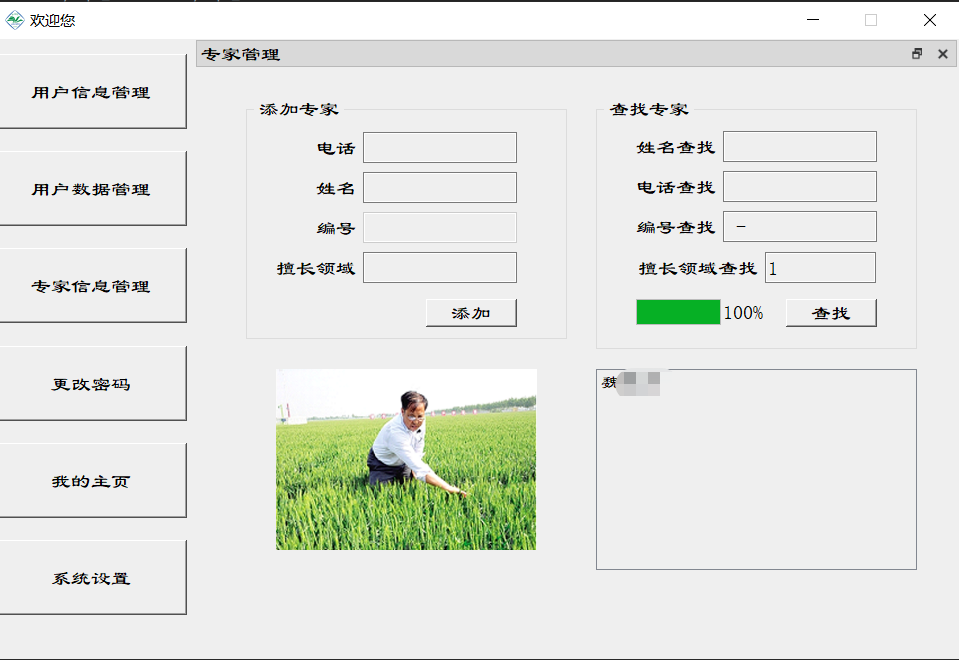
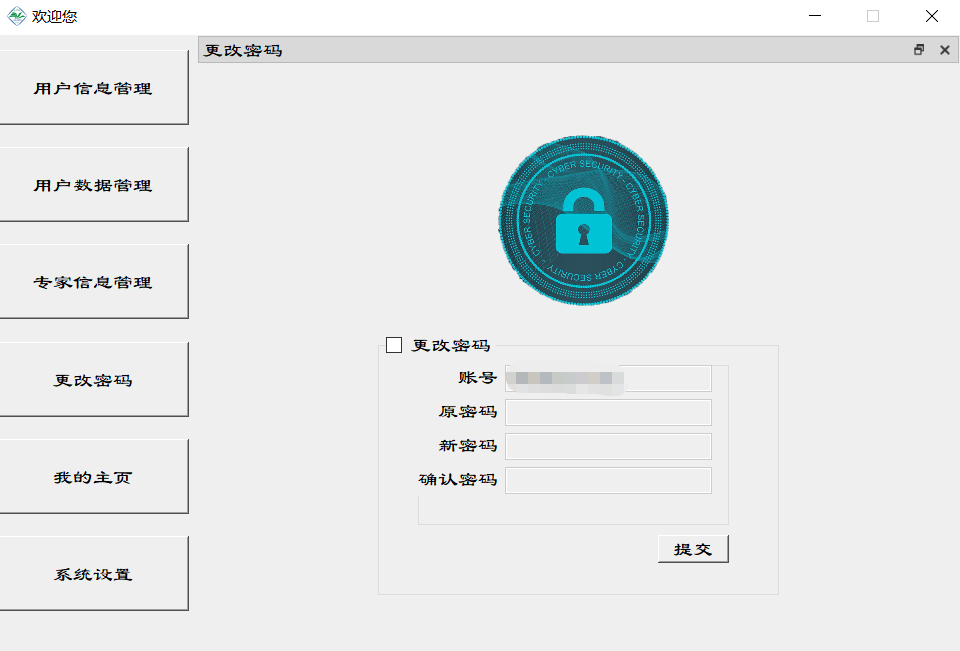

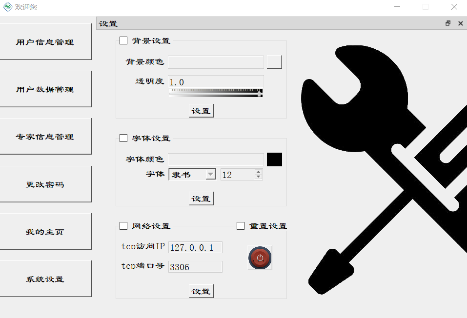

完整功能演示视频链接 https://www.bilibili.com/video/BV1GN411y7xz/
小麦病害检测系统——本系统基于pyqt5，mysql,yolov7实现了界面友好型的小麦病害检测，包括用户、管理员注册、登录，找回，融合chatgpt实现智能助手。
本项目为本人及团队成员2023上半学年软件工程作业，完整资料包含完整代码，30000字软件设计开发文档，ppt演示，效果演示视频，
项目有偿，获取请联系qq 1461103631
